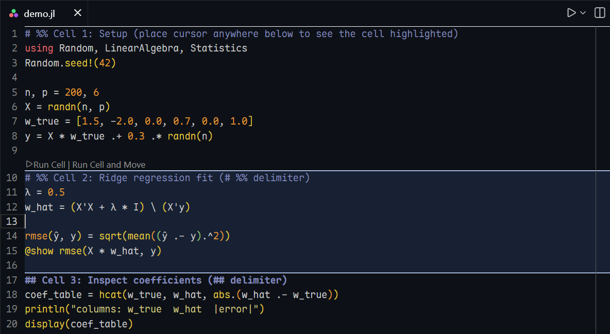
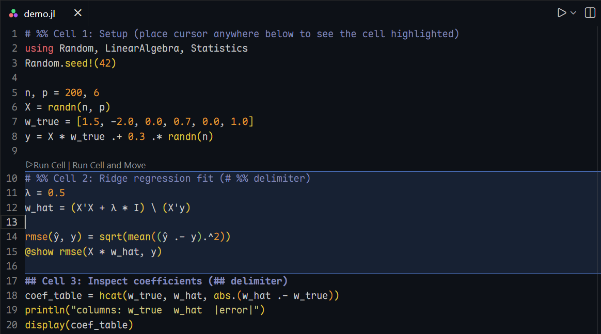
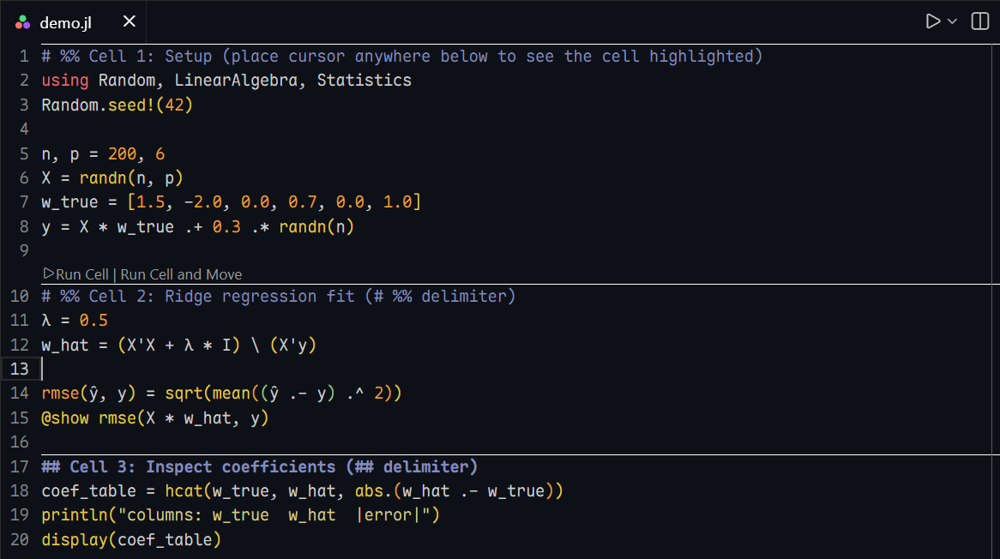

# Julia Cell Highlighter

A VS Code extension that highlights the current Julia code cell in `.jl` files and adds optional CodeLens actions to run cells.



Theme: [Shakira Warm Spectrum](https://github.com/abcdvvvv/shakira-warm-spectrum), Font: [Maple Mono](https://github.com/subframe7536/maple-font),
Delimiter line bolding: [Highlight](https://github.com/fabiospampinato/vscode-highlight)

## Quick Start

1) Install from the VS Code Marketplace.
2) Open a `.jl` file and add cell delimiters like:

```julia
## Cell 1
x = 1

## Cell 2
x + 1
```

The current cell is highlighted automatically as you move the cursor.

## What Counts as a Cell

The delimiter rules are **aligned with the Julia extension**:

- If `julia.cellDelimiters` is set, it is used.
- Otherwise the built-in defaults are used: `##`, `#%%`, `# %%`.

You can enable/disable which built-ins are active via `juliaCellHighlighter.defaultDelimiters`.

By default, the delimiter line is included in the highlighted range. When the cursor is on a delimiter line, the next cell is highlighted (if the delimiter is the last line, nothing is highlighted).

## CodeLens (Run Cell)

When enabled, CodeLens buttons appear above delimiter lines:



- **Run Cell**
- **Run Cell and Move** (executes, then moves to the next cell after a short delay)

The commands call the Julia extension's cell execution, so the execution behavior matches Julia's rules.

## Separator Lines (Independent)

You can show a visual separator line above delimiters even when highlighting is turned off.



- Controlled by `juliaCellHighlighter.showDelimiterSeparator`
- Uses its own delimiter list via `juliaCellHighlighter.separatorDelimiters`

## Excluding Files or Folders

Exclude paths from cell highlighting and CodeLens (separator lines still apply):

```json
"juliaCellHighlighter.excludePatterns": [
  "**/src/**",
  "**/test/**",
  "**/deps/**",
  "**/docs/**"
]
```

## Settings

- `juliaCellHighlighter.enabled`: Enable/disable highlighting (default: `true`)
- `juliaCellHighlighter.codeLensMode`: CodeLens display mode (`always`, `current`, `never`, default: `always`)
- `juliaCellHighlighter.backgroundColor`: Background color (default: `rgba(100, 150, 255, 0.06)`)
- `juliaCellHighlighter.borderColor`: Top/bottom border color (default: `rgba(100, 150, 255, 0.6)`)
- `juliaCellHighlighter.topBorderWidth`: Top border width (default: `2px`)
- `juliaCellHighlighter.bottomBorderWidth`: Bottom border width (default: `1px`)
- `juliaCellHighlighter.showDelimiterSeparator`: Show separator line above delimiters (default: `true`)
- `juliaCellHighlighter.delimiterSeparatorColor`: Separator color (default: `#ffffff`)
- `juliaCellHighlighter.delimiterSeparatorWidth`: Separator width (default: `1px`)
- `juliaCellHighlighter.separatorDelimiters`: Regex list for separator lines (default: `^##(?!#)`, `^#%%`, `^#\s+%%`)
- `juliaCellHighlighter.excludePatterns`: Glob patterns to exclude from cell highlighting/CodeLens (default: `**/src/**`, `**/test/**`, `**/deps/**`, `**/docs/**`)
- `juliaCellHighlighter.includeDelimiterLine`: Include delimiter line in highlight (default: `true`)
- `juliaCellHighlighter.highlightWhenNoDelimiter`: Behavior when no delimiters exist (`none` or `file`, default: `none`)
- `juliaCellHighlighter.cursorOnDelimiterBehavior`: When cursor is on delimiter (`next`, `previous`, `none`, default: `next`)
- `juliaCellHighlighter.defaultDelimiters`: Enabled built-in delimiters (`##`, `#%%`, `# %%`)
- `juliaCellHighlighter.multiCursorMode`: Multi-cursor behavior (`primary`, `union`, `first`, default: `primary`)

## Keybindings

- Toggle highlighting: `Ctrl+Shift+H` (Windows/Linux) / `Cmd+Shift+H` (macOS)

Like it? Drop a star ⭐
